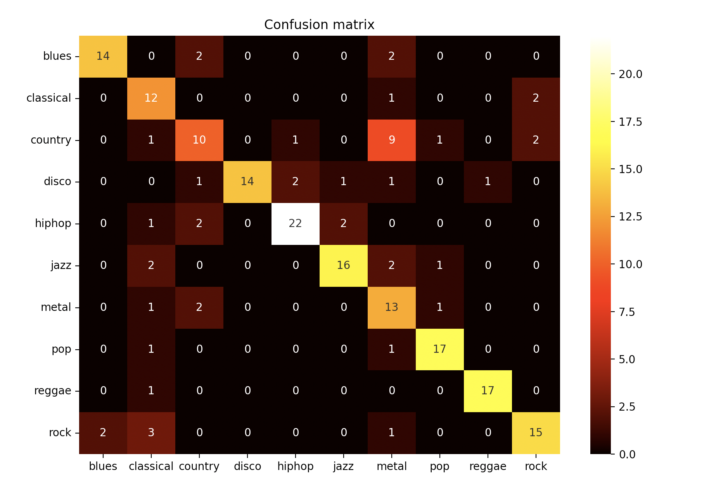

# Music Genre Classification

##### Project goals
The purpose of the task was to classify songs into corresponding genres. 

##### Technologies used
The project was made entirely in python 3.8 - a high-level programming language with an extensive library package. Thanks to its
transparent syntax it allows you to create advanced, but most of all readable source codes.

##### Implementation

The project implementation was based on the following steps:
1. Extract the mfccs of all the songs in the dataset.
2. Calculate the covariance and mean matrices and save them to *.dmp file.
3. Perform knn algorithm on all the songs in the dataset and check its performance.
4. Visualize the confusion matrix of the test dataset.
5. Check the genre of the chosen song with the use of a designed knn algorithm.

The dataset used for this project is GTZAN dataset from: [https://www.kaggle.com/andradaolteanu/gtzan-dataset-music-genre-classification](https://www.kaggle.com/andradaolteanu/gtzan-dataset-music-genre-classification).

It is divided into 10 different genres, 100 files each. The genres are:
- blues
- classical music
- country
- disco
- hiphop
- jazz
- metal
- pop
- reggae
- rock

##### Results

The average accuracy achieved is around 75%. The confusion matrix of the test set is shown in the picture below.  

